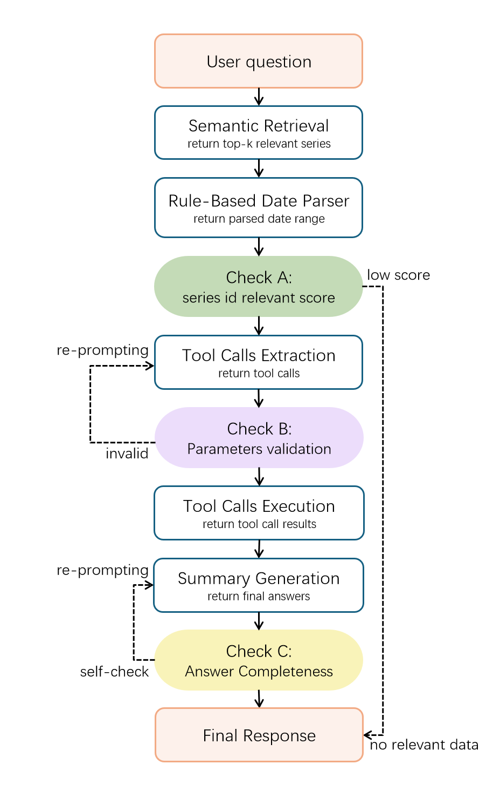

# An Agentic RAG system based on Macroeconomic Data

This is an agentic Retrieval-Augmented Generation system that answers natural language questions about US macroeconomic indicators by autonomously querying the FRED API. Given a user question, the system identifies the relevant FRED data series and date range, retrieves the time-series data via tool calls, and generates a grounded natural language summary — without requiring the user to know any series ids or API details.

The project systematically compares two models (LLaMA 3.2 and GPT-4o-mini) across three progressively enhanced agent variants: a baseline using a compact text indicator guide, a semantic retrieval version that dynamically selects the most relevant series via FAISS embeddings, and a final version incorporating a rule-based date parser and a three-layer self-check pipeline (relevance gating, parameter validation, and answer completeness verification). LLaMA 3.2 is further fine-tuned on GPT-generated reference summaries to close the summarization quality gap. Retrieval accuracy is evaluated across all six variants on a curated question benchmark covering single- and multi-series queries, relative time expressions, and out-of-scope questions.

Two directions are planned for future development. First, the knowledge base will be expanded with real-time news retrieval via NewsAPI, allowing the system to contextualize economic data with current events and analyst commentary. Second, a query router will be introduced to dynamically select the most appropriate retrieval strategy — direct generation, single-step tool call, or full agentic RAG — based on question type, reducing unnecessary API calls and latency for simpler queries.

Check the report [here](https://github.com/dcr225619/DS5500-RAG/blob/master/report.pdf).

## Get Started
1. Install the required dependencies with: `pip install -r requirements.txt --upgrade`.
2. Save your fred api key in a file named `fred_key.py`, save your openai api key in a file named `gpt_key.py`.
3. Run `wikitable_crawler.py` to get series ids file `output.json` for Fred series.
4. Run `indicator_formatter.py` to generate `indicator_guide_compact.txt` for generate a compact Fred data list for llms.

## Use Baseline Models with Compact Text Indicator Guide for Retrieval Based on LLM-Driven Autonomous Understanding (llama3.2 / gpt-4o-mini). 
1. Install llama3.2 in Docker if you want to use llama3.2 for experiment. Apply for OpenAI key to use gpt models for experiment.
2. Run `llama_api.py` to use llama3.2 for experiment on `QA.json` or `QA_test.json`. Run `gpt_api.py` to use chatgpt-mini-4o for experiment on `QA.json` or`QA_test.json`. 

## Use Semantic Retriever insted of Compact Text
1. Run `generate_series_description.py` to generate detailed descriptions for Fred series file `output.json` using chatgpt-mini-4o.
2. Run `build_series_index.py` to build series index embedding for retriever.
3. Run `llama_api_semantic_retriever.py` to use llama3.2 for experiment on `QA.json` or `QA_test.json` with your newly generated semantic retriever.
4. Run `gpt_api_semantic_retriever.py` to use gpt-4o-mini for experiment on `QA.json` or `QA_test.json` with your newly generated semantic retriever.

## RAG with self-check and fall back for improved retrieval and summarization

  

1. Run `llama_api_final.py` to use llama3.2 agentic RAG with self-check, fall back and date parser.
2. Run `gpt_api_final.py` to use gpt-4o-mini agentic RAG with self-check, fall back.

## Retrieval Accuracy Evaluation
Run `retrieval_accuracy_benchmark.ipynb` to run `AccuracyEvaluator` (evaluates series and date range retrieval accuracy) across all 6 agent variants and saves results.

| # | File | Model | Retriever |
|---|------|-------|-----------|
| 1 | `llama_api` | llama3.2 | full guide |
| 2 | `llama_api_semantic_retriever` | llama3.2 | semantic |
| 3 | `llama_api_final` | llama3.2 | semantic + date parser + checks |
| 4 | `gpt_api` | gpt-4o-mini | full guide |
| 5 | `gpt_api_semantic_retriever` | gpt-4o-mini | semantic |
| 6 | `gpt_api_final` | gpt-4o-mini | semantic + checks |

## Few-shot prompt for Better Summary
1. Prepare several human-written high-quality summary examples and put them in `few_shot_examples.py`.
2. Uncomment `*build_few_shot_messages(),` before question, after system prompt, in the summary generation prompt.
3. Run all main files to using prompt including several high-quality human-written.

## Fine-tune for Better Summary
1. Run `QA_gpt_transformer.ipynb` to generate QA results using chatgpt-4o-mini for model fine-tuning on summary generation.
2. Run `llama_finetune.ipynb` for model fine-tuning. Download the correct format of fine-tuned model or LoRA adapters according to your need. 
3. Deploy your fine-tuned model.
4. Modify parameters to run the files using your fine-tuned model.

## Summary Quality Evaluation
Run `summary_evaluation_benchmark.ipynb` to run summary evaluations with 3 metrics (BERTScore, Key Fact Coverage Rate, Hallucination Rate) across all 12 agent variants and saves results.

9 agent variants:

| # | Model | Retriever |
|---|-------|-----------|
| 1 | gpt-4o-mini | full guide |
| 2 | gpt-4o-mini | semantic |
| 3 | gpt-4o-mini (fine-tuned)| semantic + checks |
| 4 | llama3.2 | full guide |
| 5 | llama3.2 | semantic |
| 6 | llama3.2 | semantic + date parser + checks |
| 7 | llama3.2 (fine-tuned)| full guide |
| 8 | llama3.2 (fine-tuned)| semantic |
| 9 | llama3.2 (fine-tuned)| semantic + date parser + checks |

3 agent variants with few-shot prompting:

| # | Model | Retriever |
|---|-------|-----------|
| 1 | llama3.2 (few-shot)| full guide |
| 2 | llama3.2 (few-shot)| semantic |
| 3 | llama3.2 (few-shot)| semantic + date parser + checks |

## Unfinished (Future Work)
2. `news_api.py` for retrieving news article from [news api](https://newsapi.org/) (to expand the database in the future)
3. Router may be generated for dynamically selecting the best approach (direct generation, single-step retrieval or multi-step, multi-source retrieval)